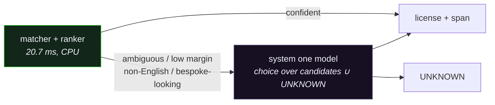

_GSoC 2026 with [FOSSology](https://github.com/fossology), mentored by Shaheem Azmal M MD, Kaushlendra Pratap and Ayush Bhardwaj._

I rebuilt license identification across two FOSSology tools. The engine that shipped reads no license text with any model. It is a **deterministic lexical cascade with a small gradient-boosted ranker** over match evidence. It is level with ScanCode on the corpora I can measure, and it runs at **20.7 ms per file on CPU**.

DEP-5 precision went from **0.652 to 0.885** over the rebuild. The learned ranker accounts for about the last **0.04** of that. Most of the rest came from finding defects.

---

## the problem

FOSSology has to say which licenses apply to every file in a source tree. Real files rarely carry a license body. They carry a three-line notice, a one-line reference, an `SPDX-License-Identifier:` tag, or nothing. Once the tag is stripped, **72% of SPDX-tagged files have no license prose at all**, so "I don't know" is the right answer most of the time.

The work splits across two tools:

- **[Nirjas](https://github.com/fossology/Nirjas)** extracts comments and decides _whether_ each one is license text.
- **[Atarashi](https://github.com/fossology/atarashi)** decides _which_ license it is, and returns the character span that proves it.

<Figure
	height={306}
	caption="How the tools fit. Every comment in the tree goes through Nirjas; the gate lets only license text through to Atarashi, which names the license and its span for the report. Minerva's datasets and evaluation train the gate and the ranker, and score both. The mix of comments is illustrative, not measured."
	load={() => import('$lib/components/figures/ToolsFlow.svelte')}
/>

Nirjas is cheap and runs on every comment. Atarashi runs only on what the gate lets through. Minerva holds the datasets and the evaluation suite that train and score both.

---

## nirjas: pick the model on cost, then fix the data

Extraction moved from regex to Tree-sitter ([#76](https://github.com/fossology/Nirjas/pull/76)). Rebuilding the test suite on committed goldens ([#82](https://github.com/fossology/Nirjas/pull/82)) promptly caught `/* */` and `<!-- -->` inside string literals being counted as comments.

For the gate, I benchmarked 15 models across five families on the same split, all on CPU with 8 threads and batch 64:

| model                     | F1    | CPU samples/s | MB  |
| ------------------------- | ----- | ------------- | --- |
| Ettin-150m, fine-tuned    | .9990 | 22            | 598 |
| Ettin-32m, fine-tuned     | .9984 | 123           | 128 |
| tfidf-char                | .9934 | 3,791         | 0.8 |
| model2vec-clf, potion-32M | .9876 | 13,091        | 129 |
| model2vec static + LR     | .9465 | 4,118         | 30  |

The top is saturated: about 0.011 F1 separates first from eleventh. So the choice came down to deployment cost, and the ~290× throughput was worth roughly one point of balanced accuracy. INT8 ONNX was the wrong lever. It gave no speedup, and per-tensor quantization collapsed accuracy to 0.56.

The shipped gate is model2vec on `potion-base-32M`. It runs at a **recall-first threshold of 0.20**, because a missed license is the expensive error and a false positive costs one extra Atarashi call. Numbers:

- **recall 0.9952 and FPR 0.0262** on the held-out test split
- **recall 1.0000** on 600 real files
- ~13k comments/s, torch-free

The biggest improvement after that came from data. Near-dedup had collapsed 15k same-register negatives to 728 unique ones. Diversifying their generation took that class from 0.9375 to ~0.99.

The model is [`rycerzes/nirjas-gate`](https://huggingface.co/rycerzes/nirjas-gate) and the data is [`rycerzes/nirjas-dataset`](https://huggingface.co/datasets/rycerzes/nirjas-dataset).

---

## the benchmark was lying

The existing Atarashi test split had two problems:

- **Circular:** 90.8% of its test fragments were verbatim substrings of their own license reference, so recall@k measured copy-detection.
- **Leaky:** 9.4% of test rows were already in train.

On real files from the-stack-smol, labelled by ScanCode, every method collapsed:

| method                     | R@1   |
| -------------------------- | ----- |
| lexical TF-IDF             | 0.298 |
| bge-small-en-v1.5          | 0.214 |
| model2vec potion-retrieval | 0.195 |

All three scored **0 of 34 on Apache-2.0**. The Apache notice sits at 95% depth of an 11,355-character reference, inside the "How to apply" appendix, and whole-document scoring drowns it.

The fix was an index, not a model. Adding ScanCode's short notice and reference rules as matchable units took R@1 from **0.298 to 0.799**.

A 28,491-fragment, 3,015-class dataset I had already published turned out to be ~86% verbatim substrings too. I dropped the classifier that depended on it, and built evaluation from **labels no matcher produced**:

| corpus        | n                     | labels                                               |
| ------------- | --------------------- | ---------------------------------------------------- |
| DEP-5         | 671 + 1,379 no-signal | Debian maintainers' `debian/copyright` records       |
| SPDX-tag      | 266 + 2,145 no-signal | author-declared tags, tag line stripped              |
| SH prevalence | 11,680                | Software Heritage blobs, weighted by real occurrence |
| SH tail       | 66                    | one human-confirmed blob per license                 |

The no-signal rows matter as much as the answerable ones. Their correct answer is UNKNOWN.

DEP-5 carries **~10% label noise**. In 63 of the 73 contradictions, two independent engines agree with each other against the label. That is bias, not variance, and a bigger crawl will not shrink it.

---

## what shipped

<Figure
	height={470}
	caption="The whole system, one file at a time. Pick an example or let it play: each file runs down Nirjas, then Atarashi, and stops at the first stage that can answer. A tagged file is settled by its SPDX line; a TODO comment never reaches Atarashi; a bespoke license should end in UNKNOWN. Pause, or step with the arrows."
	load={() => import('$lib/components/figures/PipelineFlow.svelte')}
/>

The components:

- **The index.** 27,857 short rules across 2,024 keys, extracted from scancode-toolkit at build time and committed.
- **The matcher.** Seed-and-extend over shared shingles: a shared n-gram at reference position _i_ and query position _j_ lies on diagonal _j − i_. It replaced a `difflib` core and went from **146 to 12 ms per query**.
- **The ranker.** A `HistGradientBoostingClassifier` over 17 features: run lengths, coverage, gaps, corroboration across a license's other rules, and margins to the runner-up. The features are standardised within each candidate list, because raw magnitudes fingerprint licenses (a 5,699-token reference _is_ GPL-3.0).

The ranker exists because the matcher retrieves well and orders badly. 62 of 77 wrong DEP-5 answers already had the right license in the top five, 28 of them at rank two.

Why no text model? The decisive span between near-variants is tiny inside otherwise identical text, as with GPL-2.0 against GPL-3.0. That is exactly where text models fail: PAWS scores under 40% on high-overlap pairs and HANS is below chance. For a compliance tool, the output also has to be an auditable span, not a score.

---

## the defects did the work

Every time the benchmark got sharper, it found plumbing:

<Figure
	height={390}
	caption="DEP-5 precision at each step of the rebuild, against ScanCode's 0.840. Drag the slider or hover a point to see what changed. The two orange steps are the learned ranker, and together they add about 0.04. The corpus grew from 392 to 671 queries along the way, which is why one step goes down."
	load={() => import('$lib/components/figures/PrecisionTrajectory.svelte')}
/>

| defect                                                   | effect of the fix                                                  |
| -------------------------------------------------------- | ------------------------------------------------------------------ |
| `{{required phrases}}` treated as wildcards              | identifying text had been deleted from every rule                  |
| SPDX 3.0 renamed the GPL ids; nothing bridged the rename | ~3,700 GPL rules came back; precision 0.652 → 0.795                |
| every confident candidate reported                       | 4.72 licenses per file → exact-set 0.024 → 0.763                   |
| compound AND/OR/WITH rules skipped at build time         | 13.3% of rules restored; SPDX-tag exact-set 0.599 → 0.907          |
| the eval labelled every compound candidate negative      | the ranker had been trained to reject the new layer                |
| `LICENSE.txt` run through comment extraction             | a GPL-3.0 body had lost 1,315 characters                           |
| ranker gated on the leader's family, not the whole list  | **286 of 639 Apache-2.0 files** were being reported as ImageMagick |
| the "How to apply" appendix indexed as license text      | Apache-2.0 kept losing to Pixar; 0.944 → 0.973                     |
| a non-contiguous feature matrix                          | a 7e-14 difference flipped 9 of 269 predictions                    |

The ImageMagick one is my favourite. ImageMagick's license is Apache-2.0 plus extra text, so it wins the longest run: 847 tokens against 764. Its family is OTHER, and the ranker declines on families it wasn't trained on. So nearly half of all verbatim Apache files were being called ImageMagick.

<Figure
	height={340}
	caption="Matcher evidence for one real Apache-2.0 LICENSE file. ImageMagick has the longest run but covers much less of its reference. Switch what the ranker's gate asks about: gated on the leader, the ranker never runs and the run-first ordering picks ImageMagick; gated on the list, it scores every candidate and picks Apache-2.0."
	load={() => import('$lib/components/figures/ImageMagickGate.svelte')}
/>

It stayed invisible until I ran all 11,680 prevalence blobs instead of a sample. The head corpora are notices, and the tail benchmark holds exactly one Apache file. Fixing the gate moved prevalence R@1 from **0.9468 to 0.9752**.

The non-contiguous matrix is the sneaky one. It made a deterministic evaluation look noisy, and an entire threshold sweep had been reading that artifact instead of signal.

---

## how i beat scancode, then un-beat it

On the morning of Aug 25, a paired McNemar test showed a real exact-set win over ScanCode: **p = 0.017** on DEP-5 and **p = 0.049** on SPDX-tag. It was the first difference in the project that survived a paired test.

By the afternoon it was gone. The accept threshold had been calibrated on the full dataset, so every "held-out" number leaked. Under nested cross-validation, with the threshold derived inside each training fold, the win became **p = 0.720** and **p = 0.832**.

| corpus   | metric    | atarashi | ScanCode | McNemar |
| -------- | --------- | -------- | -------- | ------- |
| DEP-5    | precision | 0.8772   | 0.8404   | –       |
| DEP-5    | R@1       | 0.8301   | 0.8316   | 1.000   |
| SPDX-tag | precision | 0.9533   | 0.9727   | –       |
| SPDX-tag | R@1       | 0.9211   | 0.9361   | 0.454   |

<Figure
	height={400}
	caption="Nested cross-validation, precision against coverage as the accept threshold moves, with ScanCode as the square. Up to τ = 0.20 atarashi is level with ScanCode on R@1 on both corpora; past that it trades answers for precision and falls significantly behind."
	load={() => import('$lib/components/figures/ThresholdVsScanCode.svelte')}
/>

So the result is level with ScanCode and ahead on nothing the data can resolve. I retracted the claim in the report.

The two notice corpora carry confidence intervals of about ±0.03. The prevalence pool is tighter (±0.003), but its labels come from ScanCode, so it can't referee a head-to-head. Resolving a 0.02 difference needs at least 1,225 independent labels. Until then you could beat ScanCode and be unable to prove it.

---

## the ml that did help

**Training at license granularity.** On the Software Heritage tail, the learned ranker was _worse_ than no ranker: 0.697 against 0.758. The cause was that a model trained on 37 licenses prefers the licenses it knows over their unseen siblings. My earlier scaling curve had said more data plateaus at ~12 license _families_, but it was measuring the wrong axis. Adding Software Heritage blobs at four per license widened training from 37 to 152 licenses and took the tail to **0.818**, at a head cost of 0.004–0.018.

**Tree depth.** After a string of negative ranker experiments I nearly called the ranker done. I decided anything was fair game instead.

I used TabPFN v2 (open weights) as a ceiling probe. It beat the shipped tree on all five folds: **0.8842 against 0.8525**. It can't ship, because its non-commercial weights are incompatible with GPL-2.0-only Atarashi. That is an ironic constraint for a license-compliance tool.

What it did show was headroom. A proper 72-point sweep, selected on in-distribution _and_ leave-one-family-out scores together, found **depth 6, lr 0.03: 0.8835**. That matches TabPFN with no new dependency, and DEP-5 R@1 went from 0.8331 to 0.8554.

The old depth limit came from sweeping depth while holding the learning rate fixed.

---

## every sweep needs a negative arm

The same mistake turned up in the matcher's constants:

- **Shingle size.** The indexing floor had been swept three times at shingle size 4. But the shingle size is the shortest matchable rule, so the floor-3 arms were measuring rules that could not match by construction. Shingle 3 with floor 3 improved every head corpus, SPDX-tag included, which is the corpus that had rejected floor 3 twice before.
- **Candidate cap.** Quality was flat from 100 to 3,200 candidates. Halving the cap to 200 more than paid for shingle 3: **25.4 ms** per file before both changes, **20.7 ms** after.
- **`min_run`.** Dropping it from 8 to 3 raised every headline number: prevalence R@1 0.9807, DEP-5 R@1 0.8838. It also made the engine answer **48% of files containing no license text**, up from 6.1%. Reverted.

<Figure
	height={280}
	caption="The same sweep scored two ways. Without files that have no license, min_run 3 wins on every metric. Add the no-signal arm and it answers 48% of files containing no license text at all."
	load={() => import('$lib/components/figures/NegativeArm.svelte')}
/>

A screen with no negative regime can't tell "found the license" from "answered anyway". It reads permissiveness as quality.

---

## the graveyard

These were measured, reverted, and written down so nobody has to re-derive them:

| idea                                           | why it died                                                       |
| ---------------------------------------------- | ----------------------------------------------------------------- |
| embeddings over the same notice index          | 0.957 vs lexical 0.963; torch for 8 wins in 600                   |
| hand-tuned tie-break and gate rules (×5)       | none helped; one took precision 0.795 → 0.429                     |
| widening top_k 5 → 20                          | retrieval ceiling 55% → 82%, tail 0.818 → 0.727                   |
| ScanCode's LicenseRef namespace (+1,700)       | 11 more licenses nameable, 0 detected. Nameable is not detectable |
| synthetic rules for 314 evidence-less licenses | exactly zero effect                                               |
| deriving sibling rules (BSD-3 minus a clause)  | a derived BSD-2 rule matches BSD-3 files near-perfectly           |
| substitution-tolerant matching                 | R@1 up, but 142 MIT files gained a compound license               |
| dropping low-coverage compound matches         | ISC collapsed to 0.02                                             |
| capping blob size at 50 KB                     | lost 155 licenses                                                 |

Every hand-tuned rule over these signals failed. At the time, I read each failure as evidence against the signal. It was evidence against hand-tuning.

---

## where it landed

| corpus        | n      | R@1        | precision  | exact-set  |
| ------------- | ------ | ---------- | ---------- | ---------- |
| DEP-5         | 671    | **0.8718** | **0.8850** | **0.8714** |
| SPDX-tag      | 266    | **0.9586** | **0.9733** | **0.9122** |
| SH prevalence | 11,680 | **0.9770** | 0.9853     | **0.9737** |
| SH tail       | 66     | **0.8333** | 0.8462     | –          |

No-signal false answers are **6.1%** on DEP-5 and **2.0%** on SPDX-tag. The engine runs at **20.7 ms per file** on CPU, with no GPU.

---

## what it still does not do

- **It is a head-of-distribution tool.** Evaluation covers 33 and 18 licenses out of 774 nameable. 288 SPDX licenses have no short-form rule anywhere, and that is a corpus problem, not an engine one.
- **It answers on 49% of bespoke licenses**, which are license text that isn't a nameable license. About a third of those answers are defensible. The wrong ones are confident, P ≈ 0.8 against a threshold of 0.024, so no calibration can reach them. The cause is rules that are mostly shared boilerplate: one GPL-1.0-or-later rule is 118 tokens, and only 11 of them identify anything.
- **The ScanCode comparison is stale.** It predates the last round of fixes, and it needs nested CV re-run at the shipped config.
- **Translated notices** are 0.83% of blobs. The engine fails safely on them by abstaining.

---

## future scope: a system one decision layer

The newest idea worth testing is the **System One** class of decision models:

- [Jev](https://www.datacamp.com/blog/system-one-models-jev), from TypeSafe
- its open relatives [Laya](https://huggingface.co/convaiinnovations/laya), [djev](https://github.com/Davipar/djev-dev) and [SemIf](https://openjev.com/)

They don't generate text. You hand them a state and a typed question: pick one of these options, score on this scale, or is this statement true. They return every option's probability in one non-autoregressive forward pass. Jev is trained to be _calibrated_: its reward pays for being right and for being honest about how sure it is. So when it says 70%, it should be right about 70% of the time.

That shape fits Atarashi unusually well:

- **The question is already typed.** The matcher produces five candidates. "Which of these, or UNKNOWN?" is a `choice`, and the span still comes from the matcher, so the output stays auditable.
- **Calibration is exactly what's missing where it fails.** On bespoke licenses the ranker is confidently wrong, at P ≈ 0.8. A threshold can't fix a confident model. A model trained to be calibrated might, and the right question there is a yes/no one: "is this a license we can name?"
- **Laya covers 100+ languages.** Translated notices are the other place the engine only abstains.

Why it would sit behind the cascade rather than replace it:

- **Only an open, local model fits.** A license scanner reads proprietary code, so a hosted API like Jev is out. Laya ships Apache-2.0 weights with an ONNX runtime. The English model is 421M parameters on ModernBERT-large, the multilingual one 322M on mmBERT-base. Apache-2.0 can't be bundled into GPL-2.0-only Atarashi either, so it would ship the way the Nirjas gate does: an optional extra that downloads weights at runtime.
- **The cost only works on the residual.** A 400M-parameter encoder on every file would blow the 20.7 ms budget. Routing just the ~3.6% the cascade can't settle keeps the median path unchanged.
- **Near-variants stay lexical.** GPL-2.0-only against -or-later is still a tiny span inside identical text, which is where every text model fails. The decision layer chooses among candidates the matcher produced. It never overrides the span evidence.
- **The calibration claims are the vendors', not ours.** Laya's calibration zero-shot is weaker than Jev's, and SemIf's probabilities are explicitly uncalibrated. Anything here has to be fine-tuned on DEP-5 and Software Heritage, and scored with the negative arms and nested CV this project already has.

The concrete next experiment:

1. Fine-tune Laya on (comment block + candidate list) → candidate or UNKNOWN.
2. Measure expected calibration error and bespoke false answers against the GBM ranker, on identical folds.
3. Build the bespoke and translated corpus first. Without it, a win would be invisible, which is the lesson from everything above.

---

## shipped

- **Atarashi**, as three stacked PRs that merge bottom-up. [#130](https://github.com/fossology/atarashi/pull/130) is the deterministic cascade and index, with no model binary, so the first reviewer sees a working engine. [#131](https://github.com/fossology/atarashi/pull/131) adds the learned ranker. [#132](https://github.com/fossology/atarashi/pull/132) adds compound expressions and the constant sweeps. 131 tests.
- **Nirjas** [#76](https://github.com/fossology/Nirjas/pull/76) and [#77](https://github.com/fossology/Nirjas/pull/77) are merged. [#82](https://github.com/fossology/Nirjas/pull/82) and [#78](https://github.com/fossology/Nirjas/pull/78) (the gate) are open.
- **Datasets:** [`rycerzes/atarashi-dep5`](https://huggingface.co/datasets/rycerzes/atarashi-dep5) and [`rycerzes/nirjas-dataset`](https://huggingface.co/datasets/rycerzes/nirjas-dataset). The evaluation suite lives in [Minerva-Dataset-Generation#6](https://github.com/fossology/Minerva-Dataset-Generation/pull/6).
- **Reports and weekly notes:** [fossology/gsoc · enhancing-atarashi](https://github.com/fossology/gsoc/tree/main/docs/2026/enhancing-atarashi).

If I did it again, I would build the benchmark before the model, give it a negative arm on day one, and keep the list of rejected ideas as carefully as the code. That record turned out to be worth more.
