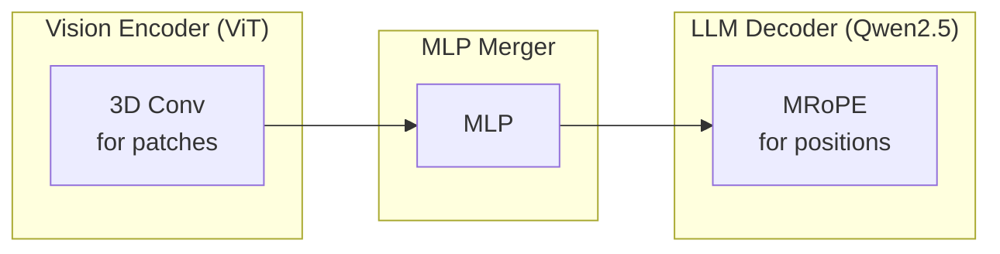
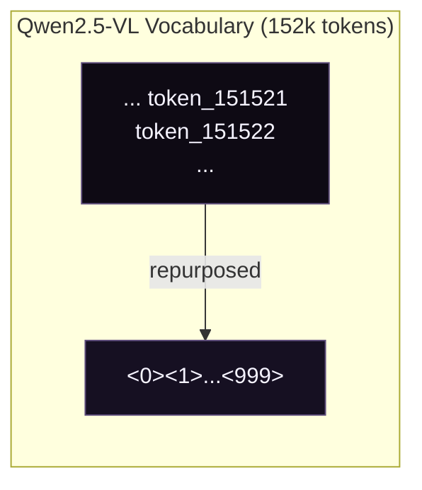
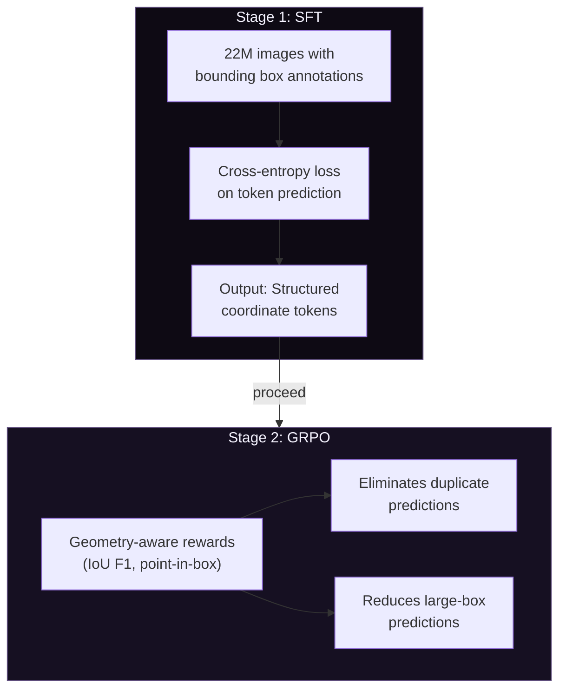

## The Problem: Electrical Single-Line Diagrams

At work, I was tasked with coming up with a pipeline which would automatically detect components in electrical single-line diagrams (SLDs). These are the schematics you see in industrial control panels — like JIC or NFPA standard schemas.

The catch? Most object models fail at this task because the symbols are small, abstract, and context-dependent, unlike the textured, natural objects they're trained to recognize. While MLLMs perform better, they are usually slow and cannot draw grounded bboxes around the objects even if they are able to identify the components correctly.


I needed a model that could:

1. **Zero-shot detect** objects it had never been trained on
2. Support **grounded bounding boxes** — precise coordinates
3. Handle **visual prompting** — show a reference symbol, ask "find more like this"
4. Do **fast OCR** on ratings labels (500KVA, 480V, 30A)
5. Be **fine-tunable** for my specific domain

This is where the rabbit hole began.

## Backstory: Grounding DINO & SAM

I'd crossed paths with IDEA Lab before. While working on [tagging-engine](https://github.com/rycerzes/tagging-engine) — my attempt at building an automatic fashion item tagger which could handle both images and videos — I stumbled across their work on [**Grounding DINO**](https://github.com/IDEA-Research/GroundingDINO) and [**Grounded SAM**](https://github.com/IDEA-Research/Grounded-Segment-Anything). These models could detect _**anything**_ with just a text prompt. Zero-shot. No training required.

That was cool and all, and at the time I just created a pipeline using Grounding DINO and [Fashion-Clip](https://github.com/patrickjohncyh/fashion-clip). But I never dug deeper into the whole process.

Fast forward to this SLD problem at work. I needed something more capable than what Grounding DINO offered. So I went back to IDEA Lab's GitHub to see what else they'd cooked up.

That's when I found it: [**Rex-Omni**](https://github.com/IDEA-Research/Rex-Omni).

The paper had been released recently. It was everything Grounding DINO was, plus visual prompting, plus OCR, plus structured bounding box output, plus — crucially — the ability to fine-tune for my electrical symbol domain.

Most models could do _some_ of what I needed, but none checked all the boxes. Rex-Omni was the only one that supported all my requirements out of the box.

## Qwen2.5-VL architecture

Rex-Omni builds on Qwen2.5-VL-3B, so understanding the base architecture is crucial. Qwen2.5-VL is Alibaba's multimodal model with three core components:



### Vision Encoder (ViT)

The vision encoder is a native-resolution Vision Transformer trained from scratch:

| Parameter           | Value   |
| ------------------- | ------- |
| Hidden Size         | 1,024   |
| Num Hidden Layers   | 24      |
| Num Attention Heads | 16      |
| Patch Size          | 14x14   |
| Window Size         | 112x112 |

Key innovations:

- **Native Dynamic Resolution**: Handles varying image sizes (16 to 2,560 visual tokens)
- **Window Attention**: Linear complexity instead of quadratic, critical for high-resolution images
- **Architectural Alignments**: Uses SwiGLU and RMSNorm like Qwen2.5 LLM

### MRoPE (Multimodal Rotary Position Embedding)

Unlike standard 1D RoPE, MRoPE uses 3D embeddings:

```
Standard RoPE:     position_id → 1D embedding
MRoPE:             position_id → 3D embedding (temporal, height, width)

For Images:
- Height position: encodes vertical spatial information
- Width position: encodes horizontal spatial information
- Temporal position: not used (images are static)
```

This allows the model to distinguish between spatial and temporal positions — critical for understanding where things are in an image. The vision-language merger is a simple two-layer MLP with GELU activation that projects ViT's 1024-dim features to the LLM's 1536-dim embeddings.

### Token Count by Resolution

| Image Size | Visual Tokens (approx.) |
| ---------- | ----------------------- |
| 224x224    | 256                     |
| 448x448    | 1,024                   |
| 672x672    | 2,304                   |
| 896x896    | 4,096                   |
| 1344x1344  | 9,216                   |

## Why Qwen2.5-VL Alone Wasn't Enough

While Qwen2.5-VL is excellent for general VQA and OCR, it has limitations for my use case:

```python
# Qwen2.5-VL can do this:
response = model.chat(
    tokenizer,
    image,
    "What objects are in this image?"
)
# Returns: "There is a transformer and a breaker in the image."

# But it CANNOT do this:
response = model.chat(
    tokenizer,
    image,
    "Detect transformers. Output bounding box in [x0, y0, x1, y1] format."
)
# Returns: "The transformer is located at x=347, y=500..."
# (Free-form text, not structured coordinates - hard to parse!)
```

Problems:

1. **No structured coordinate output**: Coordinates come as free-form text
2. **No visual prompting**: Can't show a reference and ask "find more like this"
3. **Token inefficiency**: "347" = 3 tokens vs. coordinate token = 1 token
4. **No grounding**: Can't get precise bounding box coordinates

## Enter Rex-Omni

Rex-Omni (from IDEA - International Digital Economy Academy) takes Qwen2.5-VL-3B and adds one crucial innovation: **Coordinate Tokenization**.

### Idea: using Coordinates as Tokens

Instead of treating coordinates as regression values, Rex-Omni treats them as discrete tokens in the vocabulary:

```
1. Normalize coordinates to [0, 1] range
   x_norm = x / image_width
   y_norm = y / image_height

2. Map to discrete bins [0, 999]
   x_bin = int(x_norm * 999)
   y_bin = int(y_norm * 999)

3. Convert to special tokens
   <347>, <500>, <980>, <987>
```

The key insight: **no new parameters added**. The last 1000 tokens of Qwen2.5-VL's vocabulary are repurposed as coordinate tokens.



### Structured Output Format

Rex-Omni uses special tokens for structured spatial output:

```
<|object_ref_start|>transformer<|object_ref_end|><|box_start|><347><500><980><987><|box_end|>
```

| Token                                      | Purpose                              |
| ------------------------------------------ | ------------------------------------ |
| `&lt;object_ref_start&gt;`                 | Category/semantic reference start    |
| `&lt;object_ref_end&gt;`                   | Category/semantic reference end      |
| `&lt;box_start&gt;`                        | Coordinate sequence start            |
| `&lt;box_end&gt;`                          | Coordinate sequence end              |
| `&lt;x0&gt;&lt;y0&gt;&lt;x1&gt;&lt;y1&gt;` | 4 coordinate tokens for bounding box |

### Task Unification

The same coordinate prediction handles diverse vision tasks:

| Task                 | Output Format      | Description                                    |
| -------------------- | ------------------ | ---------------------------------------------- |
| **Detection**        | 4-point box        | `<x0><y0><x1><y1>` - standard object detection |
| **Pointing**         | 2-point            | `<x><y>` - point to object location            |
| **Visual Prompting** | Boxes              | Find similar objects to reference boxes        |
| **Keypoint**         | Box + named points | JSON with bbox and keypoint coordinates        |
| **OCR Box**          | Boxes with text    | Bounding boxes with recognized text            |
| **OCR Polygon**      | Polygons with text | Polygon boundaries with text                   |
| **GUI Grounding**    | Boxes              | Detect GUI elements                            |

This is exactly what I needed — one model, multiple tasks.

## Zero-Shot Performance

Rex-Omni's zero-shot detection results are impressive:

| Model          | COCO F1@0.5 | LVIS F1@0.5 | Dense200 F1 |
| -------------- | ----------- | ----------- | ----------- |
| **Rex-Omni**   | **72.0**    | **64.3**    | **78.4**    |
| Grounding DINO | 68.1        | -           | -           |
| DINO-R50       | 65.0        | -           | -           |
| Qwen2.5-VL     | 61.2        | -           | -           |
| SEED1.5-VL     | 65.8        | -           | -           |

The Dense200 benchmark is particularly interesting — it's a dense scene with many objects, which is similar to what I'll face with electrical diagrams that can have dozens of components in a single panel.

## Training Pipeline: SFT + GRPO

Rex-Omni uses a two-stage training approach:



SFT uses teacher forcing — the model sees ground-truth tokens at each step. This creates a train-inference gap that manifests as two characteristic failure modes: **duplicate predictions** (the same coordinates generated dozens of times) and **large-box predictions** (one oversized box covering multiple objects, affecting 20.5% of Dense200 predictions).

GRPO fixes this by having the model generate complete predictions autonomously and evaluating them with geometry-aware rewards:

```python
# For Detection: Box IoU F1 Score
def box_iou_reward_func(pred_str, gt_dict):
    pred_boxes = parse_coordinates(pred_str)
    gt_boxes = gt_dict['boxes']

    precision = mean([max_iou(p, gt) for p in pred_boxes for gt in gt_boxes])
    recall = mean([max_iou(g, p) for g in gt_boxes for p in pred_boxes])
    f1 = 2 * precision * recall / (precision + recall)
    return f1  # Continuous reward [0, 1]

# For Pointing: Binary point-in-box
reward = "point_in_box"  # 1.0 if point inside GT box, 0.0 otherwise
```

| Metric                | SFT    | GRPO       | Improvement   |
| --------------------- | ------ | ---------- | ------------- |
| Dense200 F1           | 60.2   | **78.4**   | +18.2         |
| VisDrone F1           | 55.6   | **61.6**   | +6.0          |
| Duplicate predictions | Common | Eliminated | 99% reduction |
| Large-box predictions | 20.5%  | **3.5%**   | 83% reduction |

The key insight: **GRPO isn't about raw coordinate precision** — SFT already achieves 63.0 F1 on fixed detections. GRPO eliminates the behavioral issues that SFT cannot address because it always trains on ground-truth prefixes.

### Training Data: The Data Engine

Rex-Omni's 22M training images come from three automated data engines:

**Grounding Data Engine**: Captions generated by Qwen2.5-VL-7B → noun phrases extracted with SpaCy → DINO-X generates bounding boxes.

**Referring Data Engine**: Referring expressions generated with Qwen2.5-VL-7B → Molmo predicts points → SAM produces segmentation masks → geometric intersection matches points to boxes. Output: ~3M fully automated referring expressions.

**Additional Engines**: Pointing (box centers), OCR (PaddleOCR for polygonal text boundaries).

## My Use Case: Electrical Single-Line Diagrams

These diagrams have:

- **Standardized symbols**: NFPA 79 and JIC EM-1 standards
- **Labels and ratings**: "500KVA", "480V", "30A"
- **Complex layouts**: Dense panels with many components
- **Text orientation**: Often rotated or stacked

I need Rex-Omni to:

1. Detect transformer symbols, breaker symbols, disconnect switches
2. OCR the ratings/labels next to each component
3. Visual prompting: show a "reference" breaker, find all breakers

## Fine-tuning Strategy

For domain adaptation to electrical diagrams, I'll use full fine-tuning with Liger Kernel:

```python
from transformers import Qwen2_5_VLForConditionalGeneration, AutoProcessor
from liger_kernel.transformers import apply_liger_kernel_to_qwen2_vl

model = Qwen2_5_VLForConditionalGeneration.from_pretrained(
    "IDEA-Research/Rex-Omni",
    torch_dtype="auto",
    device_map="auto",
)

apply_liger_kernel_to_qwen2_vl(
    rope=True,
    mlp_swiglu=True,
    cross_entropy=True,
    fused_linear=True,
)
```

### Dataset Requirements

For fine-tuning, I'll need labeled images with bounding box annotations and varied task prompts:

```python
GROUNDING_SINGLE_REGION_STAGE_XYXY = [
    "Detect [OBJ].",
    "detect [OBJ].",
    "Please detect [OBJ] in this image.",
    "Detect [OBJ]. Output the bounding box coordinates in [x0, y0, x1, y1] format.",
    "Find [OBJ] in the image. Output the bounding box coordinates.",
    # ... 40+ varied prompts
]
```

### What Actually Gets Trained

Here's a crucial detail often missed: **the coordinate token embeddings are NOT modified during training**. Rex-Omni repurposes the last 1000 tokens from Qwen2.5-VL's existing vocabulary — no new parameters added.

| Component                       | SFT                                       | GRPO         |
| ------------------------------- | ----------------------------------------- | ------------ |
| **Vision Encoder**              | Frozen                                    | Frozen       |
| **Multimodal Projector**        | Frozen                                    | Frozen       |
| **LLM Backbone**                | Fine-tuned                                | Fine-tuned   |
| **LM Head**                     | Fine-tuned                                | Fine-tuned   |
| **Coordinate Token Embeddings** | NOT modified (repurposed from Qwen2.5-VL) | NOT modified |

### Per-Component Learning Rates

Unlike standard LLM fine-tuning, Rex-Omni uses different learning rates per module:

| Component                | Learning Rate | Notes                                                 |
| ------------------------ | ------------- | ----------------------------------------------------- |
| **LLM Backbone**         | 2e-5          | Main language model                                   |
| **Multimodal Projector** | 2e-5          | Same as LLM (initialized from Qwen2.5-VL)             |
| **Vision Encoder**       | 2e-6          | **10x lower** — preserves pre-trained vision features |

```bash
torchrun train.py \
    --config configs/sft.py \
    --deepspeed scripts/zero2.json \
    --bf16 \
    --num_train_epochs 1 \
    --per_device_train_batch_size 4 \
    --gradient_accumulation_steps 4 \
    --learning_rate 2e-5 \
    --mm_projector_lr 2e-5 \
    --vision_tower_lr 2e-6 \
    --optim adamw_torch \
    --warmup_ratio 0.03 \
    --weight_decay 0.01 \
    --max_grad_norm 1 \
    --lr_scheduler_type "cosine" \
    --gradient_checkpointing True
```

### Memory Optimization

| Technique              | VRAM Savings |
| ---------------------- | ------------ |
| LoRA                   | ~70%         |
| QLoRA (4-bit)          | ~50% more    |
| Gradient Checkpointing | ~30%         |
| Liger Kernel           | ~20-40%      |
| 8-bit Optimizer        | ~30%         |

## What Makes Rex-Omni Fine-tuning Unique

Rex-Omni's fine-tuning pipeline has several aspects that **do not follow standard sft/rl as done via unsloth or axolotl**:

### 1. Per-Component Fine-tuning Flags

```bash
--tune_mm_vision True   # Vision encoder (ViT)
--tune_mm_mlp True      # Multimodal projector (MLP merger)
--tune_mm_llm True      # LLM decoder + LM head
```

This granular control isn't available in standard fine-tuning tools.

### 2. Soft Cross-Entropy Loss for Coordinates

Instead of treating coordinate prediction as hard classification (predict exact bin), Rex-Omni uses a Gaussian soft target. If the model predicts bin 347 but the ground truth is 350 and they're within `max_tolerance_pixel` (default: 10 pixels), the loss is relaxed. This is critical — a 5-pixel error on a 1000px image is negligible, but standard cross-entropy treats it the same as a 500-pixel error.

```python
use_soft_ce_for_coords: bool = field(default=False)
coord_sigma: float = field(default=2.0)
max_tolerance_pixel: int = field(default=10)
```

### 3. Custom TSV Dataset Format

Rex-Omni uses a custom TSV format with separate image and annotation files plus byte-offset indexes for fast random access. This enables efficient loading of millions of images without storing them all in memory, and supports negative samples (`{"bbox": null}`) to train the model to output "None" for absent categories — reducing hallucinations.

### 4. Multi-Task Training

The official config trains on multiple tasks simultaneously — grounding, pointing, visual prompting, OCR — in a single run. The model learns to handle all tasks with a unified output format.

### 5. GRPO with Geometry-Aware Rewards

Standard RLHF uses reward models. Rex-Omni's GRPO uses task-specific spatial reward functions (Box IoU F1 for detection, point-in-box for pointing) that directly measure geometric accuracy.

### Summary: What You Can't Do with Unsloth/LoRA

| Feature                    | Standard Tools | Rex-Omni               |
| -------------------------- | -------------- | ---------------------- |
| Per-component LR           | No             | Yes (vision 10x lower) |
| Soft CE for coordinates    | No             | Yes                    |
| Custom TSV format          | No             | Yes                    |
| 40+ prompt variations      | No             | Built-in               |
| Negative sampling          | No             | Yes                    |
| Multi-task training        | Limited        | Yes                    |
| GRPO with IoU rewards      | No             | Yes                    |
| Coordinate token handling  | No             | Special handling       |
| Slow tokenizer requirement | N/A            | Required               |

## Known Issues to Watch

### Issue #158: Tokenization Bug [[GitHub]](https://github.com/IDEA-Research/Rex-Omni/issues/158)

There's a known bug where tokens are _added_ instead of _replaced_, causing many-to-one mapping:

```python
# WRONG: Multiple tokens map to the same ID
('âĪī', 150643), ('<0>', 150643),  # CONFLICT!
```

The embedding matrix has fewer rows (151,936) than the tokenizer vocabulary (152,665), causing this conflict.

### Issue #22: The Fix [[GitHub]](https://github.com/IDEA-Research/Rex-Omni/issues/22)

Use the official token replacement code — **replace** the last 1000 tokens, don't add new ones. Also critical:

```python
processor = AutoProcessor.from_pretrained(
    "IDEA-Research/Rex-Omni",
    use_fast=False  # IMPORTANT: fast tokenizer causes issues
)
```

### Issue #147: Loss Expectations [[GitHub]](https://github.com/IDEA-Research/Rex-Omni/issues/147)

Loss in the range 0.6-0.8 is **normal** for Rex-Omni SFT. As the author (Mountchicken) stated: "Loss of 0.6-0.8 is already very good — evaluate using metrics or demo the model instead."

### Issue #57: Vocab Size Mismatch [[GitHub]](https://github.com/IDEA-Research/Rex-Omni/issues/57)

`model.config.vocab_size` (151,936) vs `len(tokenizer)` (152,655). This is inherent to Qwen2.5-VL itself, not a Rex-Omni bug.

---

## References

- Paper: [Detect Anything via Next Point Prediction (arXiv:2510.12798)](https://arxiv.org/abs/2510.12798)
- Project: [rex-omni.github.io](https://rex-omni.github.io/)
- GitHub: [IDEA-Research/Rex-Omni](https://github.com/IDEA-Research/Rex-Omni)
- Model: [IDEA-Research/Rex-Omni](https://huggingface.co/IDEA-Research/Rex-Omni)
- Quantized: [Rex-Omni-AWQ](https://huggingface.co/IDEA-Research/Rex-Omni-AWQ)
- Fine-tuning: [2U1/Qwen-VL-Series-Finetune](https://github.com/2U1/Qwen-VL-Series-Finetune) — SFT, DPO, GRPO, CLS for Qwen VL series. A few gotchas worth noting:
  - **QLoRA + vision**: don't combine quantization (`--bits 4/8`) with vision training — use `--bits 16` if training vision modules
  - **QLoRA + Liger**: disable Liger when using QLoRA
  - **Learning rates**: `vision_model` works better at 5–10x smaller LR than `language_model` (consistent with Rex-Omni's official config)
  - **Top-k unfreeze**: if using `--unfreeze_topk_llm` or `--unfreeze_topk_vision`, keep the base module frozen first
  - **DeepSpeed**: zero2 is usually faster and more stable than zero3, at the cost of more memory

## Now what?

Now I just need to label a few thousand electrical diagrams. What's the worst that could happen 😭🥀

---

_Related: [tagging-engine](https://github.com/rycerzes/tagging-engine) - Where I first encountered Grounding DINO/SAM_
